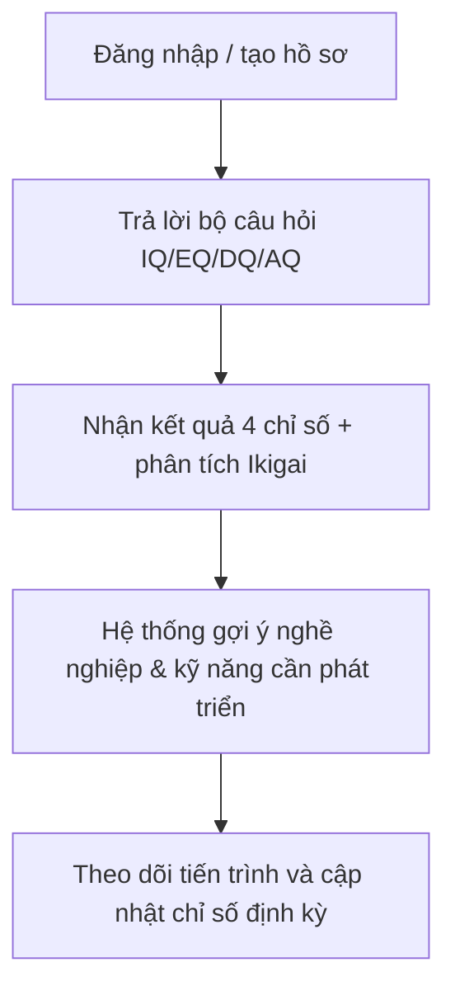

Dưới đây là **bản thiết kế ý tưởng sản phẩm MVP** dựa trên tư tưởng **IQ, EQ, DQ, AQ** và **Ikigai của Nhật Bản**, hướng tới đối tượng là **học sinh – sinh viên** nhằm giúp họ **hiểu bản thân, định hướng nghề nghiệp, và phát triển cá nhân toàn diện**.

---

## 🎯 1. Mục tiêu sản phẩm

**Sản phẩm:** “MyWay – Tìm đường riêng của bạn”
**Mục tiêu:**

* Đánh giá 4 chỉ số phát triển toàn diện (IQ, EQg, DQ, AQ).
* Gợi ý hướng đi học tập, nghề nghiệp, và mục tiêu sống (theo mô hình Ikigai).
* Cung cấp lộ trình học tập, kỹ năng, và trải nghiệm gợi ý phù hợp từng cá nhân.

---

## 🧠 2. Hệ thống chỉ số cốt lõi

| Chỉ số                         | Ý nghĩa                                    | Đo qua                                 | Ứng dụng                                              |
| ------------------------------ | ------------------------------------------ | -------------------------------------- | ----------------------------------------------------- |
| **IQ (Intelligence Quotient)** | Tư duy logic, phân tích, giải quyết vấn đề | Bài test logic, pattern, số học        | Phù hợp ngành STEM, lập trình, kỹ sư                  |
| **EQ (Emotional Quotient)**    | Nhận thức & điều khiển cảm xúc             | Câu hỏi tình huống, phản ứng cảm xúc   | Phù hợp nghề giáo, tâm lý, quản lý con người          |
| **DQ (Digital Quotient)**      | Năng lực sử dụng, sáng tạo và tư duy số    | Câu hỏi hành vi công nghệ, sáng tạo số | Phù hợp ngành công nghệ, sáng tạo nội dung, marketing |
| **AQ (Adversity Quotient)**    | Chỉ số vượt khó, khả năng thích nghi       | Câu hỏi giả lập tình huống khó khăn    | Phù hợp nghề startup, nghiên cứu, lãnh đạo            |

---

## 🌸 3. Tích hợp triết lý **Ikigai (生き甲斐)**

**Ikigai** gồm 4 vòng giao nhau:

* **What you love** (Bạn yêu thích)
* **What you are good at** (Bạn giỏi điều gì)
* **What the world needs** (Thế giới cần gì)
* **What you can be paid for** (Bạn có thể được trả tiền cho điều gì)

MVP có thể mô phỏng Ikigai bằng **biểu đồ tương tác (interactive Ikigai map)**, hiển thị vùng giao thoa lớn nhất → gợi ý nghề nghiệp và mục tiêu học tập.

---

## 🧩 4. Mô phỏng quy trình trải nghiệm người dùng (User Flow)

---

## 🧭 5. Bộ câu hỏi gợi ý cho từng nhóm chỉ số

### 🧠 IQ – Logic & tư duy

1. “Nếu tất cả A là B, và một số B là C, điều gì chắc chắn đúng?”
2. “Một chuyến tàu đi 120km trong 2 giờ. Tốc độ trung bình là bao nhiêu?”
3. “Tìm hình tiếp theo trong chuỗi hình học sau...” *(hiển thị hình ảnh)*

### 💓 EQ – Cảm xúc & xã hội

1. “Khi bị phê bình trước lớp, bạn thường cảm thấy và phản ứng thế nào?”
2. “Bạn có thường quan tâm tới cảm xúc của người khác khi thảo luận nhóm?”
3. “Khi bạn thấy bạn thân buồn, bạn sẽ làm gì?”

### 💻 DQ – Năng lực số & sáng tạo

1. “Bạn dùng mạng xã hội để học hay giải trí nhiều hơn?”
2. “Nếu bạn được giao tạo 1 video lan tỏa thông điệp tích cực, bạn sẽ chọn chủ đề gì?”
3. “Bạn có từng học kỹ năng online hoặc dùng AI hỗ trợ học tập không?”

### 🏔️ AQ – Vượt khó & thích nghi

1. “Khi gặp thất bại trong kỳ thi, bạn sẽ làm gì?”
2. “Nếu bị giao một nhiệm vụ mới, không có hướng dẫn, bạn sẽ phản ứng ra sao?”
3. “Khi làm việc nhóm với người bạn không hợp, bạn sẽ chọn cách nào?”

---

## 💼 6. Kết quả và hướng đi đề xuất

Sau khi làm bài test, hệ thống hiển thị:

* **Biểu đồ 4 trục (Radar chart)** thể hiện IQ, EQ, DQ, AQ.
* **Vùng Ikigai được gợi ý**: ví dụ “Bạn yêu thích sáng tạo, có DQ cao, EQ trung bình → Nghề gợi ý: UI/UX Designer, Digital Marketer, Content Creator.”
* **Lộ trình học tập cá nhân hóa (Personal roadmap)**:

  * Gợi ý khóa học online (Coursera, Udemy,...)
  * Gợi ý sách & dự án trải nghiệm
  * Gợi ý mentor / cộng đồng phù hợp

---

## 🔍 7. Mô phỏng giao diện MVP (ý tưởng wireframe)

* **Trang 1:** Giới thiệu và tạo tài khoản
* **Trang 2:** Bộ câu hỏi trắc nghiệm 4 nhóm (AI scoring)
* **Trang 3:** Dashboard kết quả

  * Radar chart (IQ/EQ/DQ/AQ)
  * Ikigai map
  * Nghề nghiệp phù hợp (top 3)
* **Trang 4:** Gợi ý kỹ năng cần phát triển & kế hoạch hành động

---

## 🧠 8. Công nghệ MVP đề xuất

| Thành phần          | Công nghệ gợi ý                         |
| ------------------- | --------------------------------------- |
| Frontend            | Next.js + Tailwind + Chart.js           |
| Backend             | FastAPI                    |
| Database            | PostgreSQL (lưu profile + test results) |
| AI / Recommendation | OpenAI API + Scikit-learn clustering    |

---

## ✨ 9. Hướng phát triển mở rộng

* Tích hợp **AI Coach**: gợi ý cải thiện chỉ số yếu.
* Thêm **test định kỳ hàng quý** để đo tiến bộ.
* Hợp tác với trường học / trung tâm hướng nghiệp.
* Xây dựng cộng đồng “Tìm đường riêng của bạn” để học sinh chia sẻ trải nghiệm.
